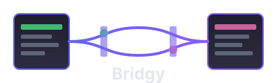

<p align="center">
  
</p>

<h1 align="center">Bridgy</h1>

<p align="center">
  Lightweight, secure iframe communication library for cross-origin messaging.
</p>

<p align="center">
  
  
  
</p>

---

## Features

- **Single Class API** - One `Bridgy` class for both parent and child
- **Secure Handshake** - 3-way handshake (SYN → SYN_ACK → ACK) before communication
- **Origin Validation** - Whitelist allowed origins for security
- **Message Queueing** - Messages sent before connection are queued automatically
- **Non-blocking** - No callback hell, connection happens in background
- **Multiple Patterns** - Fire-and-forget, event subscription, request-response
- **Debug Mode** - Built-in logging with runtime toggle
- **TypeScript** - Full type support
- **Lightweight** - ~6KB minified

## Installation

```bash
npm install @monis01/iframe-bridge
```

Or via CDN:
```html
<script src="https://cdn.example.com/bridgy.min.js"></script>
```

## Quick Start

### Parent Application (has iframe)

```typescript
import { Bridgy } from '@monis01/iframe-bridge';

const bridge = new Bridgy({
  role: 'parent',
  origins: ['https://child-app.com'],
  debug: true
});

// Send data to child (queued until connected)
bridge.send('config', { theme: 'dark', lang: 'en' });

// Listen for events from child
bridge.on('user-click', (data) => {
  console.log('User clicked:', data.buttonId);
});

// Handle requests from child
bridge.handle('get-user', async (payload) => {
  const user = await fetchUser(payload.id);
  return user;
});

// Optional: know when connected
bridge.ready()
  .then(() => console.log('Child connected'))
  .catch((err) => console.error('Connection failed:', err));
```

### Child Application (inside iframe)

```typescript
import { Bridgy } from '@monis01/iframe-bridge';

const bridge = new Bridgy({
  role: 'child',
  origins: ['https://parent-app.com'],
  debug: true
});

// Listen for events from parent
bridge.on('config', (data) => {
  applyTheme(data.theme);
});

// Send events to parent
bridge.send('user-click', { buttonId: 'submit-btn' });

// Request data from parent
const user = await bridge.request('get-user', { id: 123 });
console.log('Got user:', user);
```

## API Reference

### Constructor

```typescript
new Bridgy(config: BridgyConfig)
```

| Option | Type | Required | Description |
|--------|------|----------|-------------|
| `role` | `'parent' \| 'child'` | Yes | Parent has iframe, child is inside iframe |
| `origins` | `string[]` | Yes | Allowed origins (parent) or target origin (child) |
| `mode` | `'duplex' \| 'push' \| 'pull'` | No | Communication mode (default: `'duplex'`) |
| `debug` | `boolean` | No | Enable debug logging (default: `false`) |
| `timeout` | `number` | No | Handshake timeout in ms (default: `10000`) |

### Methods

#### Connection

| Method | Returns | Description |
|--------|---------|-------------|
| `ready()` | `Promise<void>` | Resolves when connected |
| `onReady(callback)` | `void` | Callback when connected |
| `isConnected()` | `boolean` | Check connection status |
| `getState()` | `ConnectionState` | Get current state |
| `destroy()` | `void` | Cleanup and disconnect |

#### Messaging

| Method | Returns | Description |
|--------|---------|-------------|
| `send(command, payload?)` | `void` | Fire-and-forget message |
| `on(command, handler)` | `void` | Subscribe to events |
| `off(command?, handler?)` | `void` | Unsubscribe |
| `request(command, payload?, timeout?)` | `Promise<T>` | Request-response |
| `handle(command, handler)` | `void` | Register request handler |
| `removeHandler(command)` | `void` | Remove request handler |

#### Debug

| Method | Description |
|--------|-------------|
| `enableDebug()` | Turn on console logging |
| `disableDebug()` | Turn off console logging |

## Communication Modes

| Mode | Send | Receive | Use Case |
|------|------|---------|----------|
| `duplex` | ✓ | ✓ | Two-way communication (default) |
| `push` | ✓ | ✗ | Only send messages |
| `pull` | ✗ | ✓ | Only receive messages |

```typescript
// Push only - can send but not receive
const bridge = new Bridgy({
  role: 'parent',
  origins: ['https://child.com'],
  mode: 'push'
});
```

## Handshake Flow

```
Child                              Parent
  |                                  |
  |----------- SYN ---------------->|  Child initiates
  |                                  |
  |<---------- SYN_ACK -------------|  Parent acknowledges
  |                                  |
  |----------- ACK ---------------->|  Child confirms
  |                                  |
  |========== CONNECTED ============|
```

## Message Patterns

### Fire-and-Forget

```typescript
// Sender
bridge.send('notification', { message: 'Hello!' });

// Receiver
bridge.on('notification', (data) => {
  showNotification(data.message);
});
```

### Request-Response

```typescript
// Requester
const result = await bridge.request('calculate', { a: 5, b: 3 });
console.log(result); // { sum: 8 }

// Handler
bridge.handle('calculate', (payload) => {
  return { sum: payload.a + payload.b };
});
```

### Async Handler

```typescript
bridge.handle('fetch-data', async (payload) => {
  const response = await fetch(`/api/data/${payload.id}`);
  return response.json();
});
```

## Usage with Frameworks

### Script Tag (Vanilla JS)

```html
<script src="bridgy.min.js"></script>
<script>
  const bridge = new Bridger.Bridgy({
    role: 'parent',
    origins: ['*']
  });
</script>
```

### Angular

```typescript
// bridge.service.ts
import { Injectable } from '@angular/core';
import { Bridgy } from '@monis01/iframe-bridge';

@Injectable({ providedIn: 'root' })
export class BridgeService {
  private bridge = new Bridgy({
    role: 'parent',
    origins: ['https://child-app.com']
  });

  send(command: string, data: any) {
    this.bridge.send(command, data);
  }

  onMessage(command: string, handler: (data: any) => void) {
    this.bridge.on(command, handler);
  }
}
```

### React

```typescript
// useBridge.ts
import { useEffect, useRef } from 'react';
import { Bridgy } from '@monis01/iframe-bridge';

export function useBridge(config: BridgyConfig) {
  const bridgeRef = useRef<Bridgy>();

  useEffect(() => {
    bridgeRef.current = new Bridgy(config);
    return () => bridgeRef.current?.destroy();
  }, []);

  return bridgeRef.current;
}
```

## Bundle Sizes

| Format | File | Size |
|--------|------|------|
| IIFE (CDN) | `dist/index.global.js` | **6.31 KB** |
| ESM | `dist/index.mjs` | **5.85 KB** |
| CJS | `dist/index.js` | **6.33 KB** |
| Types | `dist/index.d.ts` | **3.74 KB** |

## File Structure

```
src/
├── index.ts      (16 lines)   - Exports
├── bridge.ts     (290 lines)  - Main Bridgy class
├── types.ts      (76 lines)   - TypeScript interfaces
├── constants.ts  (9 lines)    - Default values
├── logger.ts     (37 lines)   - Debug logger
└── utils.ts      (10 lines)   - Helpers

Total: ~438 lines
```

## Browser Support

Works in all modern browsers that support `postMessage`:
- Chrome, Firefox, Safari, Edge (latest)
- IE11 (with polyfills)

## License

MIT
